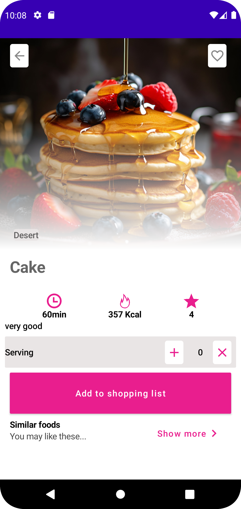
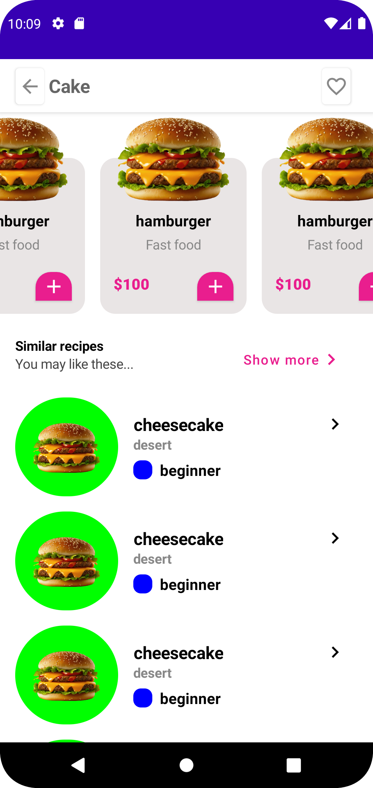

# Online Food Shop UI

## Overview

This project is an Android application that provides a user interface for an online food shop. It showcases various food items, their descriptions, and allows users to add items to a shopping list. The UI is implemented using Jetpack Compose for a modern and efficient design.

## Features

- **Food Information Display**: Shows detailed information about different food items, including preparation time, calories, and rating.
- **Dynamic Toolbar**: A toolbar that changes appearance based on scroll position to enhance user experience.
- **Serving Control**: Allows users to adjust the serving size of food items.
- **Shopping List**: Users can add food items to their shopping list with a single click.
- **Similar Foods and Recipes**: Displays a list of similar food items and recipes that users might be interested in.

## Installation

1. Clone the repository to your local machine.
   ```bash
   git clone https://github.com/yourusername/online-food-shop-ui.git
   ```
2. Open the project in Android Studio.
3. Build and run the application on an emulator or physical device.


## Screenshots





## Code Structure

- **MainActivity**: The entry point of the application.
- **Cooking**: The main composable function that orchestrates the UI components.
- **ToolBar**: Implements the dynamic toolbar.
- **Content**: Displays the main content of the screen including food details and lists.
- **Components**: Various reusable composable functions such as `BasicInfo`, `Serving`, `Shopping`, `SimilarFood`, and `SimilarRecipes`.

